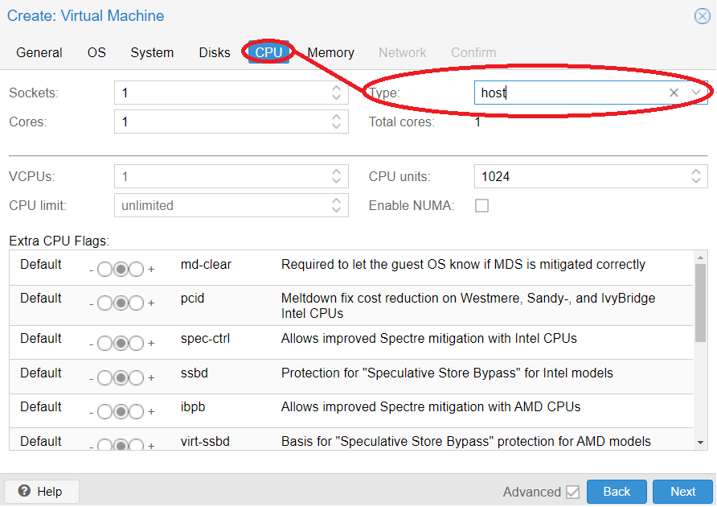
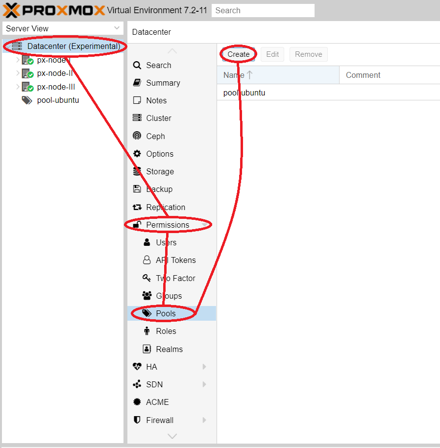
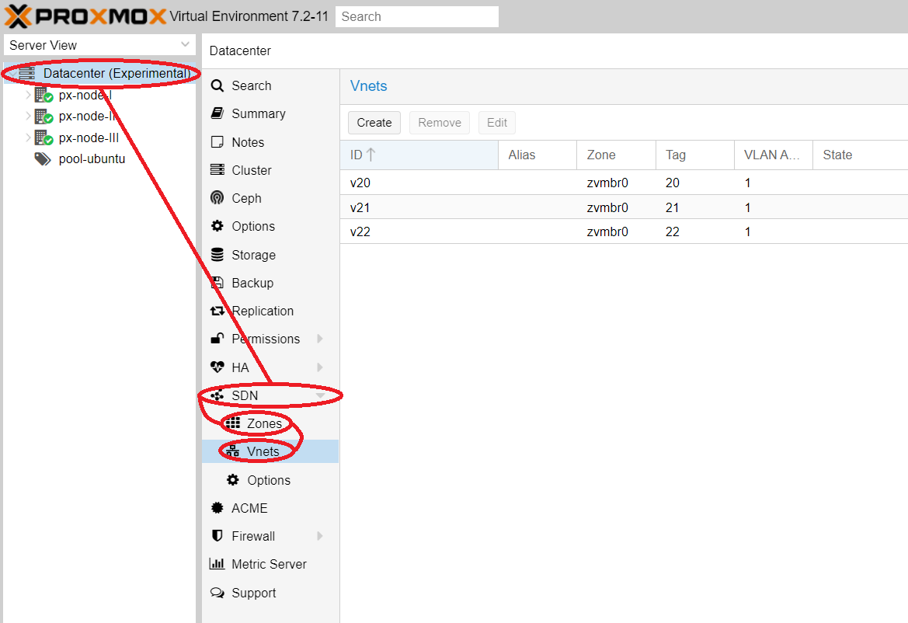
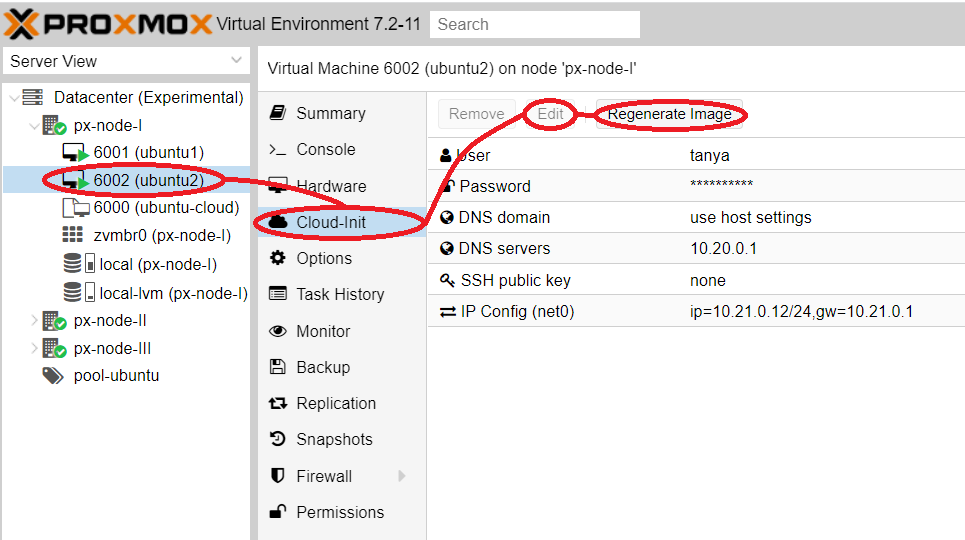

## Practice --- How to set up VLANs

Prerequisites:
- Proxmox node with ~ 16 GiB RAM and ~ 90 GB local storage
- opnsense VM
- 3 manjaro VMs
- VLAN3, VLAN20 created & set up in opnsense firewall
- Proxmox ISO uploaded
- Cloud-init scripts
---------------------------------------------------------------------------
6. Prepare proxmox template
* Create a VM with Proxmox ISO (Note: When creating VM on tab CPU: Type = host)
  - 
* Start VM
* Install SDN
    - To enable the experimental Software Defined Network (SDN) integration, you need to install the libpve-network-perl and ifupdown2 packages on every node:
        ```
        apt update
        apt install libpve-network-perl ifupdown2
        ```
    - Note: Proxmox VE version 7 and above come installed with ifupdown2.
    - After this, you need to add the following line to the end of the /etc/network/interfaces configuration file, so that the SDN configuration gets included and activated.
        ```
        source /etc/network/interfaces.d/*
        ```
* Install qemu guest agent
    ```
    apt install qemu-guest-agent
    systemctl enable --now qemu-guest-agent
    systemctl status qemu-guest-agent
    ```
* Set up VLAN3 via update /etc/network/interfaces on each proxmox VM (ip addresses will be different, i.e. .20, .21, .22!)
    ```   
    auto lo
    iface lo inet loopback
    
    iface ens18 inet manual
    
    auto vmbr0.3
    iface vmbr0.3 inet static
           address  10.3.0.21/24
           gateway  10.3.0.1
    
    auto vmbr0
    iface vmbr0 inet manual
            bridge-ports ens18
            bridge-stp off
            bridge-fd 0
            bridge-vlan-aware yes
            bridge-vids 2-4094
    ```
```
Note: instead of range you can mention particular admissible VLANs, i.e. "bridge-vids 3 20 21 22" in our case.
```  

* Get cloud-init scripts:
  ```
  apt install git
  git clone --branch 28102022 https://github.com/Alliedium/awesome-linux-config.git
  ```
* Send ssh key to be placed /root/.ssh/id_rsa_cloudinit.pub
* Shutdown the VM
* Convert to template
---------------------------------------------------------------------------
7. Make 3 linked clones from the template
* On each clone make the following:
* Update hostname & ip address
    ```
    hostnamectl set-hostname <...>
    ```
* Edit hostname and/or ip in the following configuration files:
    ```
    nano /etc/hosts
    ```
    ```
    nano /etc/postfix/main.cf
    ```
    ```
    nano /etc/network/interfaces
    ```
* Check if /etc/network/interfaces has no errors after the update
    ```
    ifreload -s -a
    ```
* Reload interfaces
    ```
    ifreload -a
    ```
* Re-generate certificates
    - Remove the apparently relevant files manually:
      ```
      cd /etc/pve
      rm pve-root-ca.pem priv/pve-root-ca.key nodes/*/pve-ssl.{key,pem}
      ```
    - Regenerate the certificates and restart pveproxy:
      ```
      pvecm updatecerts --force
      systemctl restart pveproxy
      ```
* Check connectivity of each node to each node via ping
---------------------------------------------------------------------------
8. Create cluster
* Open each node in a separate tab in browser on manjaro2
* Select Datacenter on the 1st node UI > Create cluster > Copy Join info
* On 2nd and 3rd node click Join cluster, paste the info and enter password
---------------------------------------------------------------------------
9. Create ubuntu VMs on 1st node
* Create resource pool via command line:
  ```
  pvesh create /pools --poolid ubuntu-pool
  ```
* or via UI:
  - 
* Go to the git directory you've cloned from git:
```
cd ./awesome-linux-config/proxmox7/cloud-init/
```
* Copy & edit .env.example (Pz_VM_TEMPLATE_ID, Pz_VM_ID_PREFIX, Pz_TARGET_NODE_LIST)
* Apply env settings as described in README.md
* Run script to download cloud-init image: download-cloud-init-images.sh
* Run script to create ubuntu cloud-init template on 1st node: create-template.sh
* Run script to create 2 linked clones on 1st node - ubuntu1 & ubuntu2: create-vms.sh
* DO NOT START VMS BEFORE SETUP
---------------------------------------------------------------------------
10. Set up ubuntu1
* Create VLAN20 in SDN (SDN > Zones > Add > VLAN; SDN > Vnets > Create)
  - 
* Update ubuntu1 settings: Hardware > Network device > Edit > select v20 instead of vmbr0
* Go to Cloud-Init > edit DNS servers & IP Config:
  - 10.20.0.1
  - ip=10.20.0.11/24,gw=10.20.0.1
```
Note 1: instead of manual editing of DNS, IP & gateway, you can edit create-vms.sh script to use DHCP instead of providing static ip address.
Change this line:
  - qm set ${vm_cur_id}  --ipconfig0 ip=${vm_cur_ip}/${Pz_IP_MASK_N_BITS},gw=${Pz_GATEWAY}
To this line:
  - qm set ${vm_cur_id} --ipconfig0 ip=dhcp
```
```
Note 2: It is possible to change the image parameters via Cloud-init tab later, then to regenerate image, and execute hard reboot (stop & start the VM).
User can regenerate image after updating parameters without stopping the VM, but in this case in order to apply the changes it's necessary to run following commands within the VM's shell:
cloud-init clean
cloud-init init
```
- 
* Start ubuntu1
* Install qemu-guest-agent
* Check DNS address is set correctly in resolv.conf
  ```
  resolvectl status
  ```
* In case any correction to network configuration is necessary, it might be done this way:
  ```
  nano /etc/netplan/50-cloud-init.yaml
  netplan apply
  ```
* Validate connectivity is as expected via ping the following ip addresses :
    - VLAN20 gateway
    - opnsense gateway
    - web
    - manjaro1
    - manjaro2
    - manjaro3
---------------------------------------------------------------------------
11. Set up ubuntu2
* Set up VLAN21 in opnsense:
    - Interfaces > Other Types > VLAN > [+]
    - Interfaces > Assignments > VLAN > [+]
    - In interfaces appeared new options, edit
        - enable
        - description
        - static ip
        - ipv4 - set address
    - Service > DHCPv4
    - Firewall > Rules
      - Create a new rule(s) according to your VLAN to VLAN connectivity plan
      - Check 'Log packets that are handled by this rule' checkbox for each new rule
    - Set connectivity VLAN20 : VLAN21
* Update ubuntu2 settings: Hardware > Network device > Edit > select v21 instead of vmbr0
* Go to Cloud-Init > edit DNS servers & IP Config:
  - 10.21.0.1
  - ip=10.21.0.12/24,gw=10.21.0.1
* Start ubuntu2
* Install qemu-guest-agent
* Check DNS address is set correctly in resolv.conf
  ```
  resolvectl status
  ```
* Validate connectivity is as expected via ping the following ip addresses :
    - VLAN20 gateway
    - opnsense gateway
    - web
    - manjaro1
    - manjaro2
    - manjaro3
    - ubuntu1
---------------------------------------------------------------------------
12.Create ubuntu VMs on 2nd node
* Go to the git directory you've cloned from git:
```
cd ./awesome-linux-config/proxmox7/cloud-init/
```
* Copy & edit .env.example (Pz_VM_TEMPLATE_ID, Pz_VM_ID_PREFIX, Pz_TARGET_NODE_LIST)
* Apply env settings as described in README.md
* Run script to download cloud-init image on 2nd node: download-cloud-init-images.sh
* Run script to create ubuntu cloud-init template on 2nd node: create-template.sh
* Run script to create 2 linked clones on 2nd node - ubuntu3 & ubuntu4: create-vms.sh
* DO NOT START VMS BEFORE SETUP
---------------------------------------------------------------------------
13. Set up ubuntu3
* Update ubuntu3 settings: Hardware > Network device > Edit > select v21 instead of vmbr0
* Go to Cloud-Init > edit DNS servers & IP Config:
  - 10.21.0.1
  - ip=10.21.0.13/24,gw=10.21.0.1
* Start ubuntu3
* Install qemu-guest-agent
* Check DNS address is set correctly in resolv.conf
  ```
  resolvectl status
  ```
* Validate connectivity is as expected via ping the following ip addresses :
    - VLAN21 gateway
    - opnsense gateway
    - web
    - VLAN3
    - ubuntu1
    - ubuntu2
---------------------------------------------------------------------------
14. Set up ubuntu4
* Set up VLAN22 in opnsense:
* Interfaces > Other Types > VLAN > [+]
* Interfaces > Assignments > VLAN > [+]
* In interfaces appeared new options, edit
    - enable
    - description
    - static ip
    - ipv4 - set address
    - Service > DHCPv4
    - Firewall > Rules
      - Create a new rule(s) according to your VLAN to VLAN connectivity plan
      - Check 'Log packets that are handled by this rule' checkbox for each new rule
* Update ubuntu4 settings: Hardware > Network device > Edit > select v22 instead of vmbr0
* Go to Cloud-Init > edit DNS servers & IP Config:
  - 10.22.0.1
  - ip=10.22.0.14/24,gw=10.22.0.1
* Start ubuntu4
* Install qemu-guest-agent
* Check DNS address is set correctly in resolv.conf
  ```
  resolvectl status
  ```
* Validate connectivity is as expected via ping the following ip addresses :
    - VLAN22 gateway
    - opnsense gateway
    - web
    - VLAN3
    - ubuntu1
    - ubuntu2
    - ubuntu3
---------------------------------------------------------------------------
15. Create ubuntu VMs on 3rd node
* Go to the git directory you've cloned from git:
```
cd ./awesome-linux-config/proxmox7/cloud-init/
```
* Copy & edit .env.example (Pz_VM_TEMPLATE_ID, Pz_VM_ID_PREFIX, Pz_TARGET_NODE_LIST)
* Apply env settings as described in README.md
* Run script to download cloud-init image on 3rd node: download-cloud-init-images.sh
* Run script to create ubuntu clou-dinit template on 3rd node: create-template.sh
* Run script to create 2 linked clones on 3rd node - ubuntu5 & ubuntu6: create-vms.sh
* DO NOT START VMS BEFORE SETUP
---------------------------------------------------------------------------
16. Set up ubuntu5
* Update ubuntu5 settings: Hardware > Network device > Edit > select v20 instead of vmbr0
* Go to Cloud-Init > edit DNS servers & IP Config:
  - 10.20.0.1
  - ip=10.20.0.15/24,gw=10.20.0.1 
* Start ubuntu5
* Install qemu-guest-agent
* Check DNS address is set correctly in resolv.conf
  ```
  resolvectl status
  ```
* Validate connectivity is as expected via ping the following ip addresses :
    - VLAN20 gateway
    - opnsense gateway
    - web
    - VLAN3
    - VLAN20 VMs
    - VLAN21 VMs
    - VLAN22 VMs
---------------------------------------------------------------------------
17. Set up ubuntu6
* Update ubuntu6 settings: Hardware > Network device > Edit > select v22 instead of vmbr0
* Go to Cloud-Init > edit DNS servers & IP Config:
  - 10.22.0.1
  - ip=10.22.0.16/24,gw=10.22.0.1
* Start ubuntu6
* Install qemu-guest-agent
* Check DNS address is set correctly in resolv.conf
  ```
  resolvectl status
  ```
* Validate connectivity is as expected via ping the following ip addresses :
    - VLAN22 gateway
    - opnsense gateway
    - web
    - VLAN3
    - VLAN20 VMs
    - VLAN21 VMs
    - VLAN22 VMs