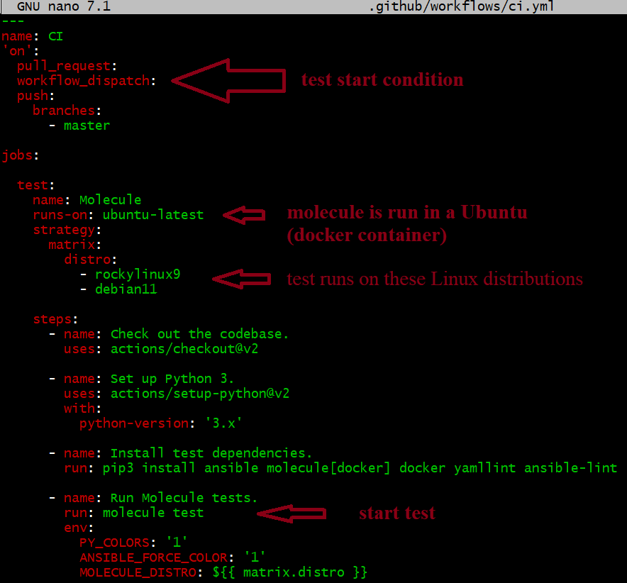
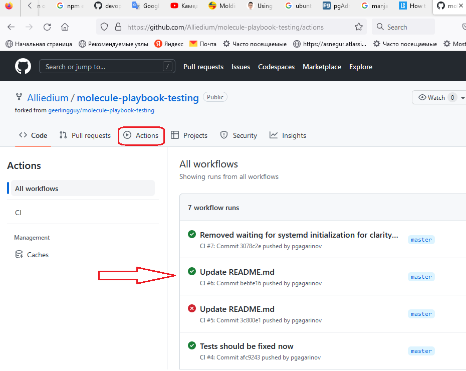
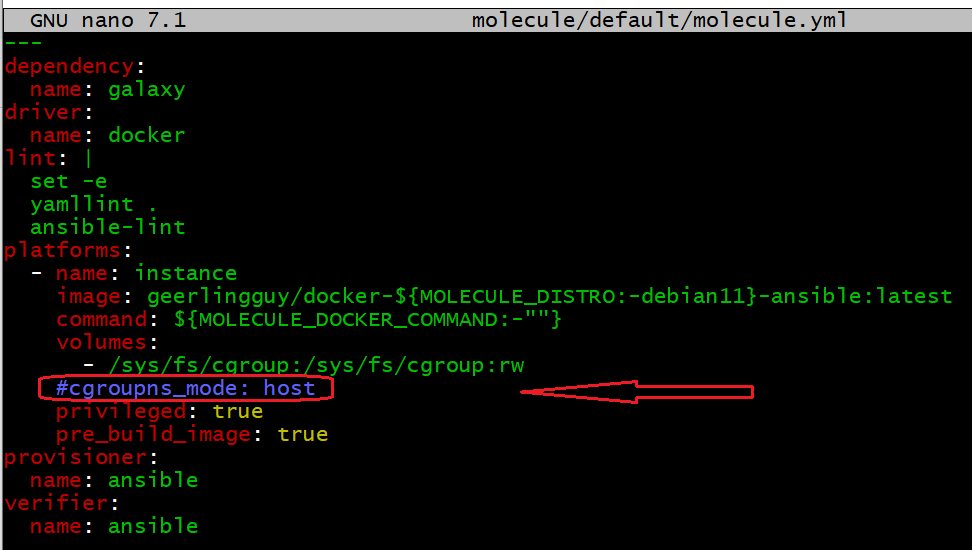

# Ansible: advanced concepts, PART 5 ##

Please, perform common [Prerequisites](https://github.com/Alliedium/awesome-ansible/tree/main/README.md#prerequisites).
Then, taking into account [General Notes on inventories and playbooks](https://github.com/Alliedium/awesome-ansible#2-general-notes-on-creating-your-own-custom-inventory-and-playbooks)
please follow the steps of [Example 6](https://github.com/Alliedium/awesome-ansible/blob/main/06-custom-roles) and [Example 7](https://github.com/Alliedium/awesome-ansible/blob/main/07-include-vs-import)
from the project [Alliedium/awesome-ansible](https://github.com/Alliedium/awesome-ansible/).

## Molecule - Ansible playbook testing tool

`Molecule` project is designed to aid in the development and testing of Ansible roles.

`Molecule` provides support for testing with multiple instances, operating systems and distributions, virtualization providers, test frameworks and testing scenarios.

This guide shows how to automate the launch of `Ansible` playbook tests in the  `github` repository and run `molecule` the test and debug locally.

All commands are executed in the `Manjaro` Linux distribution. For an example of testing ansible playbook, the [Alliedium/molecule-playbook-testing](https://github.com/Alliedium/molecule-playbook-testing) project is used. This `ansible` playbook `./molecule-playbook-testing/main.yml` installs apache server.

Playbook testing is:
  - preparing the environment where the playbook will be run
  - run the playbook
  - check that the playbook has worked as it should
  - cleaning the results of the playbook run
  
A special mechanism for creating an environment in which the playbook will be tested is called a `driver` in the `molecule`. The environment can be, for example, a `virtual machine` or a `docker container`. We will use a docker container as environment and [geerlingguy/docker-debian11-ansible](https://github.com/geerlingguy/docker-debian11-ansible/blob/master/Dockerfile) special image - based on `Debian`.

Description of the `molecule` testing infrastructure in the `./molecule-playbook-testing/molecule/default/` folder.

  
    
  - `./molecule/default` - test script
  - `./molecule/default/molecule.yml` - description infrastructure for testing
  - `./molecule/default/converge.yml` - playbook launch
  - `./molecule/default/verify.yml` - the test

  
  

  

  

### Prerequisite


  1.1 Install `Ansible`

  ```
  sudo pacman -S ansible
  ```

  1.2 Install `molecule` and `molecule-docker`. In terminal run the command

  ```
  sudo pacman -S molecule-docker
  ```

  1.3 Clone [ Alliedium/molecule-playbook-testing ](https://github.com/Alliedium/molecule-playbook-testing) test `ansible` playbook

  ```
  git clone https://github.com/Alliedium/molecule-playbook-testing.git
  ```

### Automate the launch of `Ansible` playbook tests in the `github` repository
  
  In the `github` repository, Actions is the `CI/CD` system that runs the tests.

   - Setting up testing in `github` repository Actions.
      In the project folder create `./.github/workflows/ci.yml` file. Like this.

      

      See Action on `github` repository

      

      The playbook is launched twice, to check for idempotency.

### Run local `molecule` test
     
   - Go to `molecule-playbook-testing` project folder
      
      ```
      cd molecule-playbook-testing
      molecule test
      ```

### Debug test locally
let's make the `molecule` test fail to show how we can debug it
   - edit `nano molecule/default/molecule.yml` file
   
      

   - Run the test
      
      ```
      molecule converge
      ```
    
      or

      ```
      molecule test --destroy=never
      ```
   
   This ensures that the container where the ansible role is being tested does not stop.

   - See the test result

      

   - Get list of running docker `molecule` containers

       ```
       molecule list
       ```

   - Enter in container
  
       ```
       molecule login
       ```

       In the container, you can investigate the reasons for the failure of the test

   - Exit from container

        ```
        exit
        ```

   - Delete `molecula` container

        ```
        molecula destroy
        ```

   - Cleanup action

        ```
        molecula cleanup
        ```
     
### Start your `Ansible` playbook development by creating a folder structure

  ```
  molecule init role alliedium.our_new_project_folder --driver-name docker
  ```

  - Show folder structure
  
  ```
  ls
  ```

        


# References on: Ansible #

1. [Manjaro basic bash scripts](https://github.com/Alliedium/awesome-linux-config/blob/master/manjaro/basic/)
2. [install_4server_all bash script](https://github.com/Alliedium/awesome-linux-config/blob/master/manjaro/basic/install_4server_all.sh)
3. [Install multiple collections with a requirements file](https://docs.ansible.com/ansible/latest/galaxy/user_guide.html#install-multiple-collections-with-a-requirements-file)
4. [Ansible Roles : Basics & How to Combine Them With Playbooks](https://spacelift.io/blog/ansible-roles)
5. [ansible.builtin.template module - Template a file out to a target host](https://docs.ansible.com/ansible/latest/collections/ansible/builtin/template_module.html)
6. [ansible.builtin.systemd module - Manage systemd units](https://docs.ansible.com/ansible/latest/collections/ansible/builtin/systemd_module.html)
7. [Using roles at the play level](https://docs.ansible.com/ansible/latest/playbook_guide/playbooks_reuse_roles.html#using-roles-at-the-play-level)
8. [Set the order of task execution in Ansible with these two keywords: pre_tasks and post_tasks](https://www.redhat.com/sysadmin/ansible-pretasks-posttasks)
9. [Using Ansible roles](https://docs.ansible.com/ansible/latest/playbook_guide/playbooks_reuse_roles.html#using-roles)
10. [ansible.builtin.include_role module – Load and execute a role](https://docs.ansible.com/ansible/latest/collections/ansible/builtin/include_role_module.html)
11. [ansible.builtin.import_role module – Import a role into a play](https://docs.ansible.com/ansible/latest/collections/ansible/builtin/import_role_module.html)
12. [Manjaro basic bash scripts for users executed by sysadmin](https://github.com/Alliedium/awesome-linux-config/tree/master/manjaro/basic/sysadmin)
13. [Manjaro basic bash scripts for user executed by users themselves](https://github.com/Alliedium/awesome-linux-config/tree/master/manjaro/basic/user)
14. [ansible.builtin.getent module – A wrapper to the unix getent utility](https://docs.ansible.com/ansible/latest/collections/ansible/builtin/getent_module.html)
15. [getent — Linux manual page](https://man7.org/linux/man-pages/man1/getent.1.html)
16. [ansible.builtin.user module – Manage user accounts](https://docs.ansible.com/ansible/latest/collections/ansible/builtin/user_module.html)
17. [include vs. import: Dynamic vs. Static](https://docs.ansible.com/ansible/2.9/user_guide/playbooks_reuse.html#dynamic-vs-static)
18. [Tradeoffs and Pitfalls Between Includes and Imports](https://docs.ansible.com/ansible/2.9/user_guide/playbooks_reuse.html#tradeoffs-and-pitfalls-between-includes-and-imports)
19. [Including and Importing](https://docs.ansible.com/ansible/2.9/user_guide/playbooks_reuse_includes.html)
20. [Ansible 101 - Include vs Import](https://www.ansiblejunky.com/blog/ansible-101-include-vs-import/)
21. [Difference between include & import in Ansible](https://heshandharmasena.medium.com/different-between-include-import-in-ansible-576629795516)
22. [Ansible import vs include – Loops](https://chewonice.com/2022/01/18/ansible-import-vs-include-loops/)
23. [Ansible Include and Import with differences explanined!](https://www.devopsschool.com/blog/ansible-include-and-import-with-differences-explanined/)
24. [Understanding privilege escalation: become](https://docs.ansible.com/ansible/latest/playbook_guide/playbooks_privilege_escalation.html)
25. [Dynamic includes and attribute inheritance](https://docs.ansible.com/ansible/latest/porting_guides/porting_guide_2.5.html#dynamic-includes-and-attribute-inheritance)
26. [git_config – Read and write git configuration](https://docs.ansible.com/ansible/2.9/modules/git_config_module.html)
27. [ansible.builtin.file module – Manage files and file properties](https://docs.ansible.com/ansible/latest/collections/ansible/builtin/file_module.html)
28. [How to Create a File in Ansible](https://phoenixnap.com/kb/ansible-create-file)
29. [ansible.builtin.copy module – Copy files to remote locations](https://docs.ansible.com/ansible/latest/collections/ansible/builtin/copy_module.html)
30. [ansible.builtin.find module – Return a list of files based on specific criteria](https://docs.ansible.com/ansible/latest/collections/ansible/builtin/find_module.html)
31. [How to delete multiple files / directories in Ansible](https://www.mydailytutorials.com/ansible-delete-multiple-files-directories-ansible/)
32. [ansible.builtin.get_url module – Downloads files from HTTP, HTTPS, or FTP to node](https://docs.ansible.com/ansible/latest/collections/ansible/builtin/get_url_module.html)
33. [community.general.npm module – Manage node.js packages with npm](https://docs.ansible.com/ansible/latest/collections/community/general/npm_module.html)
34. [Ansible Lint Documentation](https://ansible-lint.readthedocs.io/)
35. [About Ansible Molecule](https://molecule.readthedocs.io/en/latest/)
36. [geerlingguy/molecule-playbook-testing](https://github.com/geerlingguy/molecule-playbook-testing)
37. [Debian 11 (Bullseye) Ansible Test Image](https://github.com/geerlingguy/docker-debian11-ansible)
38. [molecule-driver](https://github.com/topics/molecule-driver)
39. [Developing and Testing Ansible Roles with Molecule and Podman - Part 2](https://www.ansible.com/blog/developing-and-testing-ansible-roles-with-molecule-and-podman-part-2)
